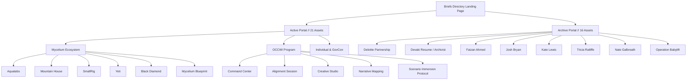

# Signalform Briefs Directory // Design & Architecture Mockup

To show you our precise understanding of the **Signalform Brand System** and how the new briefs will integrate into the landing page, we have generated a high-fidelity visual mockup of the updated directory dashboard.

## Dashboard Design Direction

The directory is designed with a premium, dark-first editorial layout combining high-end typography and a structured, modular Bento-grid structure.

### Key Aesthetic Principles Implemented:
1. **Typography as Architecture**: Display headlines feature expressive, elegant serifs (Newsreader/Playfair) balanced against clean, high-contrast monospace metadata and sans-serif tags.
2. **Glassmorphism Panels**: UI controls and filter toolbars ("Search Descriptor") float gracefully over the deep canvas with semi-transparency and subtle 1px border highlights.
3. **Curated Color Ecosystem**: Curated HSL colors representing individual client domains (e.g., MEDENTECH navy, SAIC emerald, OCCWI command red, Mycelium neon) give every brief a custom, unique presence.
4. **Organic Noise Texture**: A premium, low-opacity SVG noise overlay runs across the canvas, grounding the digital UI in a tactile, high-end paper feel.

---

## Complete Briefs Taxonomy (37 Assets)

Below is how the complete directory is structured after we sync the unregistered files:

### 1. Active Client Portals (13 Assets)
*   **Mycelium Ecosystem**: 6 briefs (including the new `aquatabs`, `mountain-house`, `smallrig`, and `yeti` briefs) representing distributed global technology partnerships.
*   **OCCWI Program**: 5 briefs (including the new `scenario-immersion-protocol`, `creative-studio-proposal`, and `narrative-mapping-pilot`) focused on primary prevention and resilience.
*   **GovCon & Personal**: 2 briefs (`christopher-liechty` and the new `saic` capture brief).

### 2. Archive Client Portals (11 Assets)
*   **Deloitte & Systems**: `deloitte` (the Rebecca call synthesis), `josh-mike-1218` (strategic emergence), and `archive-nate`.
*   **Creative Portals**: `faizan-ahmed`, `devaki-resume`, `kate-lewis`, `tricia-ratliffe`, `archive-devaki`.
*   **Operation Babylift**: The community-led archival project transforming records of war into acts of repair.

### 3. Single-File Briefs (4 Assets)
*   **brookes**: `briefs/brooke.html` (Anonymous Intimacy).
*   **krisnan**: `briefs/krisnan.html` (Four Schisms).
*   **Skills**: 4 registered internal agent scripts (`narrative-architecture`, `story-forensics`, `tactical-viz`, `mission-ops`).
