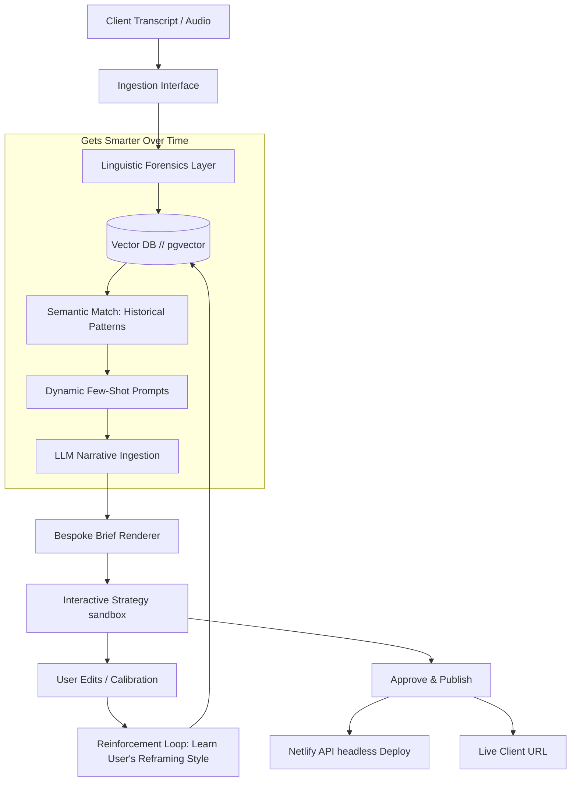

# Product Architecture Blueprint // The Smart Ingestion Platform

This document outlines the technical architecture to transform the static Signalform briefs directory into a live, production-grade SaaS product that dynamically ingests transcripts, auto-generates bespoke digital maps, and physically gets smarter through a reinforcement loop.

---

## 🏗️ System Architecture Flow

The following diagram maps out how raw meeting notes traverse the system, get processed through neural layers, dynamically generate code, and feed the reinforcement learning loop.



---

## 🧬 Core Smart Modules

To build a product that actually gets smarter, we must move beyond static templating and implement four distinct production layers:

### 1. Neural Semantic Memory (Vector DB)
*   **The Problem:** The system currently forgets past work when generating a new brief.
*   **The Solution:** Ingest all transcripts and brief structures into a vector database (e.g., SQLite-vec or PostgreSQL + `pgvector`). 
*   **How it gets smarter:** When a new client note is ingested, the system semantically searches its entire history. It finds past briefs that shared similar challenges (e.g., *"commodity service provider trying to pivot to GovCon"*), extracts their reframing vectors, and injects them into the model context as few-shot examples. The more briefs you write, the larger the contextual library, and the sharper the AI's linguistic reframing becomes.

### 2. Live LLM-Powered Incubation API (`/api/incubate`)
*   **The Backend:** Build a lightweight Python (FastAPI) or Node.js backend.
*   **Structured Outputs:** Use OpenAI's function calling or Gemini's structured JSON schemas to enforce strict compliance with the **Signalform Structure**:
    ```json
    {
      "throughline": "string",
      "problem_layer": {
        "surface": "string",
        "deeper": "string",
        "structural": "string"
      },
      "path": "string",
      "purpose": "string",
      "roadmap": ["string"]
    }
    ```
*   **System Prompts:** Programmatically lock in the exact core guidelines of the [story-forensics](file:///.agent/skills/story-forensics/SKILL.md) and [narrative-architecture](file:///.agent/skills/narrative-architecture/SKILL.md) skills into the backend pipeline.

### 3. Headless Bespoke Renderer & Automated Deployment
*   **The Renderer:** A templating service that parses the JSON output and builds the HTML/CSS using pre-configured, modular layouts (Dossier Split, Linear Editorial, Bento Schematic).
*   **Palette Generation:** Automatically extracts theme-dominant colors using the client's industry taxonomy, applying desaturated HSL parameters for dark backgrounds to maintain WCAG contrast.
*   **Headless Push:** Integrates with the GitHub/Netlify APIs to programmatically commit the new folder and trigger an instant edge deployment without requiring manual terminal operations.

### 4. Human-in-the-Loop Reinforcement Loop (The Flywheel)
*   **The Calibration Editor:** When the AI draft is generated, it loads in an interactive visual editor on your dashboard.
*   **Reframing Capture:** If the AI outputs a generic line and you manually rewrite it (e.g., changing *"I manage video crews"* to *"I calibrate visual performance for scale"*), the system logs the **Before** and **After** states.
*   **Neural Fine-Tuning:** These corrections are pushed back into the vector database as highly weighted fine-tuning vectors, training the system to write exactly in your voice. Over time, the drafts require less and less manual calibration.

---

## 🛠️ The Initial Working Prototype Architecture

To deploy this as a functional tool you can immediately use next week, we can assemble an elegant **Local Server Integration**:

> [!NOTE]
> **Minimal Infrastructure Stack:**
> 1. **Frontend:** Elevated, fully-responsive dashboard with editable card components.
> 2. **Backend:** Python + FastAPI server running locally (`uvicorn main:app`).
> 3. **AI integration:** Direct API integration using a secure local `.env` containing your OpenAI/Anthropic API keys.
> 4. **Storage:** A local JSON file acting as an initial persistent database before migrating to PostgreSQL.

---

## 💬 Next Steps & User Feedback Request

We are highly excited about transforming this into a fully operational product. 

> [!IMPORTANT]
> **To proceed, please share your preferences on:**
> 1. **Infrastructure Hosting:** Would you prefer this to be set up as a **Local desktop application** (running via a Python server on your local machine) or a **Cloud-hosted application** (deployed on Vercel/Netlify with a backend database)?
> 2. **LLM Provider:** Do you have a preferred API model provider (e.g., Anthropic Claude-3.5-Sonnet, Google Gemini-1.5-Pro, or OpenAI GPT-4o)?
